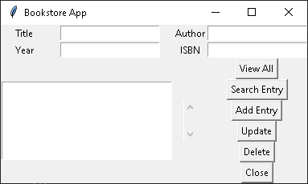

# Python Bookstore app🐍📖

### A simple Python CRUD, build with Tkinter Library for the user interface

### Buttons
- View All
Show all records in the database
- Search Entry
This button makes a search in the data base for any value wrote in any entry widget
- Add Entry
Save a new record in the data base with the values of each entry
- Update
When you press "View all" select a record in the listBox and each value of this will load in entry widgets and you can change this values, finally you would press "Update" for save the record with the new values

- Delete
When you want delete a record, you would press "View All" and select the record in the listBox and press "Delete"

